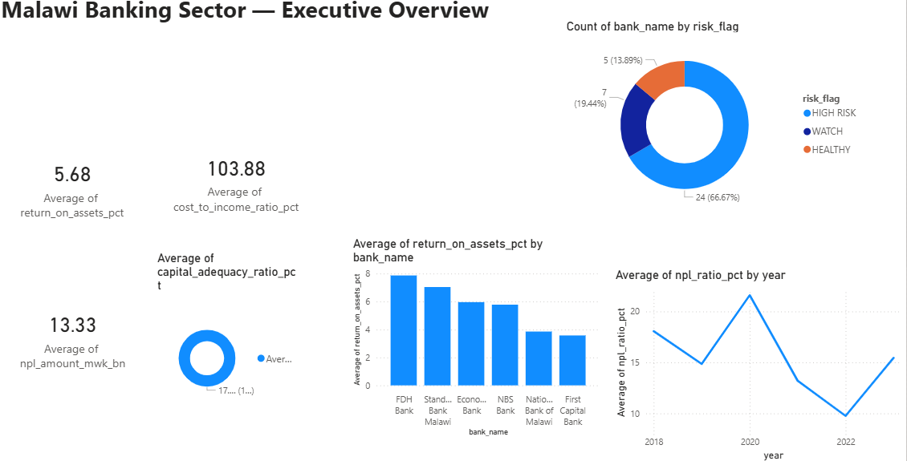
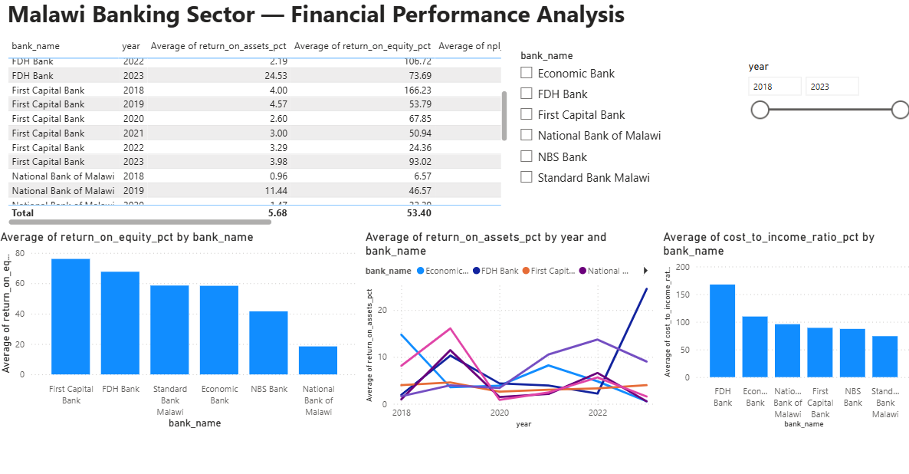
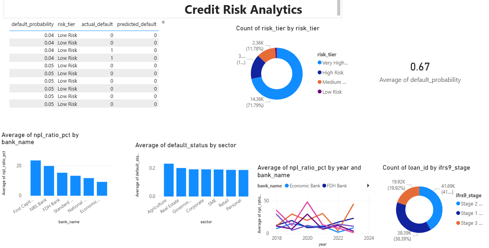
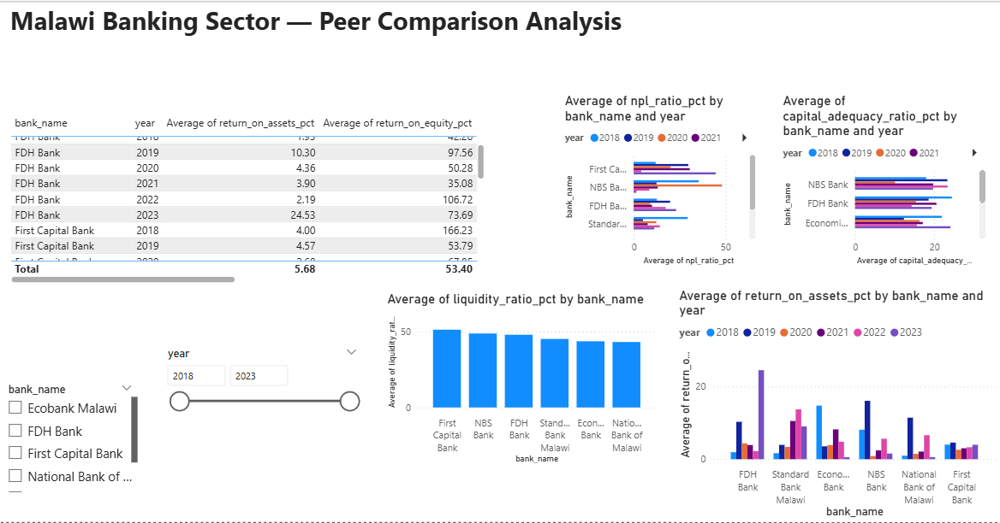
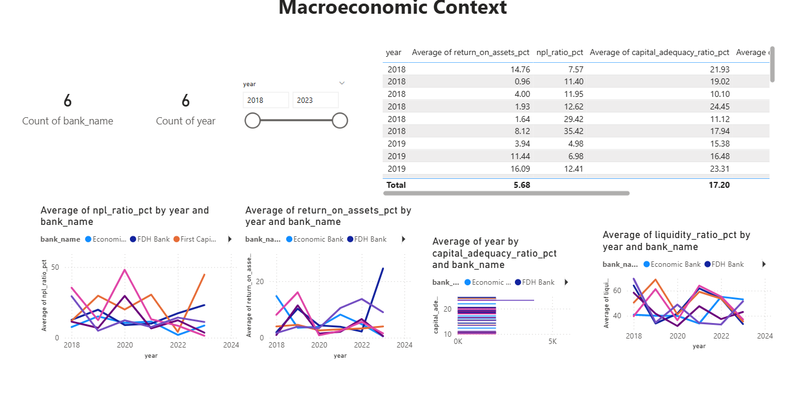

#  Malawi Banking Analytics Dashboard
### Financial Performance & Credit Risk Analytics Platform


---

##  Project Overview

A fully deployable, enterprise-grade analytics platform that monitors
the financial performance of Malawi's major commercial banks and
assesses credit risk using advanced machine learning models.

This project is built to international standards including:
-  Basel III/IV capital adequacy framework
-  IFRS 9 Expected Credit Loss (ECL) modeling
-  SHAP model explainability (EU GDPR compliant)
-  Production-grade cloud pipeline architecture

---

##  Banks Covered

| # | Bank |
|---|------|
| 1 | National Bank of Malawi |
| 2 | Standard Bank Malawi |
| 3 | First Capital Bank |
| 4 | NBS Bank |
| 5 | FDH Bank |
| 6 | Ecobank Malawi |

**Period:** 2018 — 2023

---

##  Technology Stack

| Layer | Tools |
|-------|-------|
| Data Collection | Python, pdfplumber, pandas |
| Machine Learning | XGBoost, Scikit-learn, SHAP |
| Statistical Modeling | R, ggplot2, caret |
| Visualization | Power BI, matplotlib, seaborn |
| Cloud Pipeline | AWS Lambda, Apache Airflow |
| Data Warehouse | Google BigQuery |
| Engineering | GitHub, Docker, pytest |

---

## Model Performance

| Metric | Score |
|--------|-------|
| AUC-ROC | **0.8161** |
| Gini Score | **0.6323** |
| CV Mean AUC | **0.8184** |
| Training Records | 100,000 |

---

##  Project Structure

malawi-banking-analytics/
├── data/
│   ├── raw/              # Source data from RBM and banks
│   ├── processed/        # Cleaned data and model outputs
│   └── synthetic/        # 100,000 synthetic loan records
├── src/
│   ├── data_collection.py    # CAMELS ratio calculation
│   ├── synthetic_loans.py    # Loan data generator
│   └── credit_risk_model.py  # XGBoost + SHAP model
├── notebooks/            # Jupyter EDA notebooks
├── tests/                # pytest unit tests
├── airflow/              # Pipeline DAG definitions
└── README.md

---

## Quick Start

### Prerequisites
- Python 3.11+
- R 4.3+

### Installation

```bash
# Clone the repository
git clone https://github.com/mwandirakings-prog/malawi-banking-analytics.git

# Navigate to project
cd malawi-banking-analytics

# Install dependencies
pip install -r requirements.txt
```

### Run the Pipeline

```bash
# Step 1 - Generate banking data
py src/data_collection.py

# Step 2 - Generate synthetic loans
py src/synthetic_loans.py

# Step 3 - Train credit risk model
py src/credit_risk_model.py
```

---

##  Key Findings

-  **Agriculture sector** has highest default rate at **23%**
-  **FDH Bank** showed highest ROA in 2023 at **24.5%**
-  **41,689 loans** classified as IFRS 9 Stage 2
-  **19,918 loans** classified as IFRS 9 Stage 3 Credit Impaired
-  Sector NPL ratio consistently above RBM threshold of 5%

---

##  International Regulatory Alignment

This project methodology aligns with:
- **Basel III/IV** -Capital adequacy monitoring
- **IFRS 9** -Three-stage Expected Credit Loss model
- **SR 11-7** -Model risk management standards
- **EU GDPR** -SHAP explainability for automated decisions
## Dashboard Screenshots

### Page 1-Executive Overview


### Page 2 - Financial Performance


### Page 3 - Credit Risk Analytics


### Page 4 - Peer Comparison


### Page 5 - Macroeconomic Context


---
# Related project
https://github.com/mwandirakings-prog/military-training-analytics

##  Author

**Kings Mwandira**
-BSc Mathematics-University of Malawi
-MBA Business Analytics-O.P. Jindal Global University

---

## License

MIT License- Free to use and adapt with attribution.
